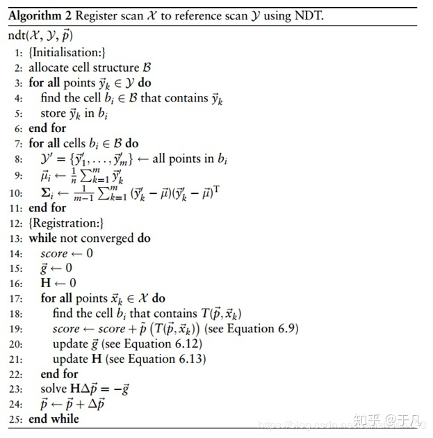
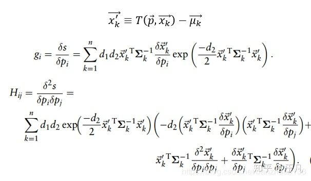

 ## NDT scan registration ## 

Martin Magnusson 2009.
from Normal-Distributions Transform an Efficient Representation for Registration, Surface Analysis, and Loop Detection

solve this $$ \mathbf{H\Delta \bar p} = -\bar g $$ with Newton’s algorithm 

More details at computeTransformation in autoware.ai/src/autoware/core_perception/ndt_cpu/src/NormalDistributionsTransform.cpp